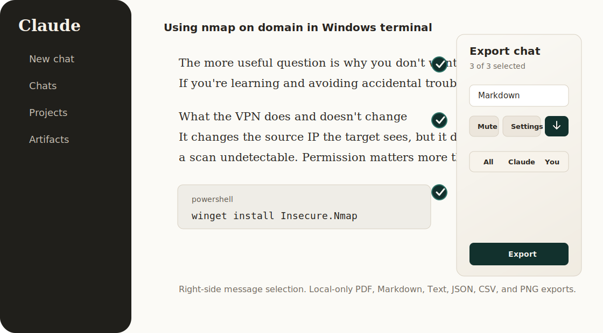

# AI Chat Exporter

Open-source, privacy-first browser extension for exporting Claude, ChatGPT,
Gemini, and Grok conversations to PDF, Markdown, Text, JSON, CSV, and PNG.



## Highlights

- Export Claude, ChatGPT, Gemini, and Grok chats to PDF, Markdown, Text, JSON,
  CSV, and PNG.
- Select individual messages directly in the chat with right-side selection
  boxes.
- Use quick selection controls for all messages, assistant messages, your
  messages, or none. The assistant label follows the current app.
- Preserve common advanced outputs including block and inline math,
  syntax-highlighted code blocks, tables, lists, headings, and structured
  Claude formatting.
- Customize filename, document title, PDF paper size, PDF theme, and page
  numbers.
- Mute export alerts when you want silent local downloads.
- Runs locally in Chrome and Firefox with no analytics, tracking, remote
  logging, or server-side PDF generation.

## Privacy Model

AI Chat Exporter reads selected content from the supported AI chat page you are
viewing and generates files locally in your browser.

It does not:

- send conversation content to a server
- store exported conversations
- use analytics or telemetry
- request access to all websites
- require a background service worker

PDF export uses the browser print dialog, so PDF creation remains local.

## Permissions

The extension intentionally keeps permissions narrow:

- `activeTab`: lets the popup talk to the current tab when you click the
  extension.
- `storage`: saves local export preferences only, such as your last selected
  format. Conversation content, filenames, and titles are not stored.
- Claude: `https://claude.ai/*`, `https://*.claude.ai/*`
- ChatGPT: `https://chatgpt.com/*`, `https://*.chatgpt.com/*`,
  `https://chat.openai.com/*`
- Gemini: `https://gemini.google.com/*`
- Grok: `https://grok.com/*`, `https://*.grok.com/*`

There is no `downloads`, `tabs`, or `<all_urls>` permission.

## Install From Source

Install dependencies are not required. You only need Node.js to build the
browser bundles.

```bash
npm run build
```

### Chrome

1. Open `chrome://extensions`.
2. Enable Developer mode.
3. Click **Load unpacked**.
4. Select `dist/chrome`.

### Firefox

1. Open `about:debugging#/runtime/this-firefox`.
2. Click **Load Temporary Add-on**.
3. Select `dist/firefox/manifest.json`.

Temporary Firefox add-ons are removed when Firefox restarts. For persistent
installation, package and sign the extension through Mozilla Add-ons.

## Usage

1. Open a conversation on Claude, ChatGPT, Gemini, or Grok.
2. Click the native-looking **Export** button next to the app's share/export controls, or
   open the extension popup and click **Open exporter**.
3. Select messages using the right-side boxes or the quick selection controls.
4. Pick an export format.
5. Click **Export**.

Keyboard shortcuts while the panel is open:

- `Alt+A`: select all
- `Alt+C`: select assistant messages
- `Alt+Y`: select your messages
- `Alt+N` or `Alt+D`: deselect all

## Build, Test, And Package

```bash
npm run icons      # regenerate extension icons
npm run check      # build both targets and run smoke tests
npm run package    # create Chrome ZIP and Firefox XPI artifacts
npm run release    # check and package
```

Release artifacts are written to `web-ext-artifacts/`.

## Project Structure

```text
extension/
  content/          Multi-provider scraper, export panel, and local file exporters
  icons/            Source icon plus generated manifest PNG icons
  shared/           Shared browser utilities
  manifest.*.json   Browser-specific source manifests
scripts/
  build.mjs         Creates dist/chrome and dist/firefox
  generate-icons.mjs
  package.mjs       Creates Chrome ZIP and Firefox XPI packages
  smoke-test.mjs    Static safety and packaging checks
docs/
  visuals/          README visuals
```

## Browser Support

- Chrome and Chromium-based browsers with Manifest V3 support.
- Firefox 121 or newer.

AI chat apps update their page markup often. The scraper uses provider-aware
selectors and fallbacks, but please open an issue if a UI change breaks exports.

## Security

Please report security issues privately. See [SECURITY.md](SECURITY.md).

## License

MIT. See [LICENSE](LICENSE).

## Disclaimer

This project is not affiliated with Anthropic or Claude.
